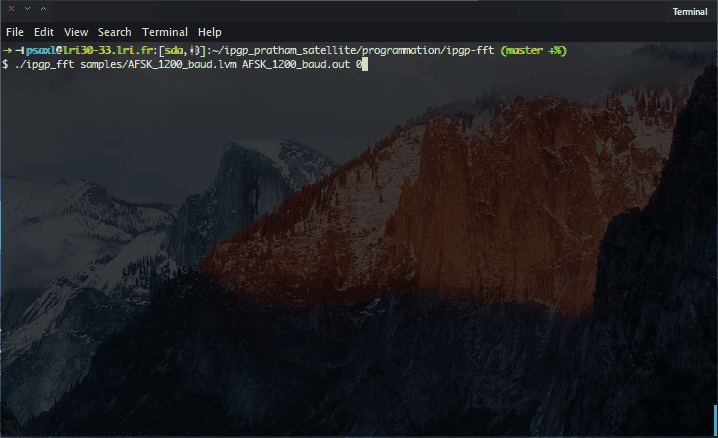
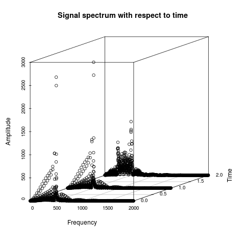

IPGP-FFT - Spectral analysis with window optimization
==============

ipgp_fft is yet another spectrum analyzer (based on the discrete Fourier transform), providing a sprectrum with several window functions for signal optimization.

For more information on strategies for choosing windows, you may refer to [The Fundamentals of FFT-Based Signal Analysis and Measurement, Cerna-Harvey (National Instruments, Application Note 041)](http://www.lumerink.com/courses/ece697/docs/Papers/The%20Fundamentals%20of%20FFT-Based%20Signal%20Analysis%20and%20Measurements.pdf).

Downloading and building
=============

To download you can click upon or type the following in the Terminal:

	git clone git://github.com/EmptyStackExn/ipgp-fft.git

The directory `./ipgp-fft/` is created. You need to compile:

	cd ipgp-fft
	make

You can now execute the program with the following arguments:

	./ipgp_fft [INPUT FILE] [OUTPUT FILE] [WINDOW FUNCTION ID]

You can also produce a 3D plot in the current directory with [R](http://www.r-project.org/) with:

	make plot SPECTRUM=[SPRECTRUM FILE PREVIOUSLY PRODUCED]

Or, as well a heatmap plot with [Gnuplot](http://www.gnuplot.info/):

	make heatmap_plot SPECTRUM=[SPRECTRUM FILE PREVIOUSLY PRODUCED]

")

Usage
=============

This unstable version not (yet) user-friendly. Parameters for FT computings need to be changed in `ipgp_fft.c` file at the following lines:

        // BEGIN physics -------------------------------------------------------------------------------
        unsigned int n_samples = 0;    // DO NOT FILL HERE!                                    // (unit)

        ...
        
        int field = 0;
        // END physics ---------------------------------------------------------------------------------

Specifications for input and output files
---------------------------

The input file is a sequence of lines consisting of ASCII decimal numbers seperated by tab spaces `\t`. A line stands for an acquisition at a time _t_ and yet several fields in a line represents the different indexed channels of the ADC. This specification is compatible with comma-delimited [LabVIEW Measurement filetype](http://www.ni.com/white-paper/4139/en). Pratham filetype specifications will soon get available in the next versions.

Those who have commma-delimiter files are invited to convert their files with dot-delimiter for floating points number representation with:

        sed -i 's/,/./g' [FILE(S)]

The output file is a [comma-seperated values (CSV)](http://supercsv.sourceforge.net/csvSpecification.html) file.

Troubleshooting 
---------------

You can report bugs at <nguyenva@informatique.univ-paris-diderot.fr>

Minimum system requirements
---------------------------

- [gcc](http://cran.r-project.org/web/packages/scatterplot3d/index.html)
- [R](http://www.r-project.org/) with [scatterplot3d library](http://cran.r-project.org/web/packages/scatterplot3d/index.html) (for graphics)

LICENSE
=======

The Pratham software system is not free software. This release can be used for evaluation, research and education purposes, but not for commercial purposes. The copyright to this code is held by Institut de Physique du Globe de Paris and distributed under the INRIA Non-Commercial License Agreement. All rights reserved.

THE PROVIDER MAKES NO REPRESENTATIONS ABOUT THE SUITABILITY, USE, OR PERFORMANCE OF THIS SOFTWARE OR ABOUT ANY CONTENT OR INFORMATION MADE ACCESSIBLE BY THE SOFTWARE, FOR ANY PURPOSE. THE SOFTWARE IS PROVIDED "AS IS," WITHOUT EXPRESS OR IMPLIED WARRANTIES INCLUDING, BUT NOT LIMITED TO, ANY IMPLIED WARRANTIES OF MERCHANTABILITY, FITNESS FOR A PARTICULAR PURPOSE, OR NONINFRINGEMENT WITH RESPECT TO THE SOFTWARE. THE PROVIDER IS NOT OBLIGATED TO SUPPORT OR ISSUE UPDATES TO THE SOFTWARE.

Hai Nguyen Van <nguyenva@informatique.univ-paris-diderot.fr>
